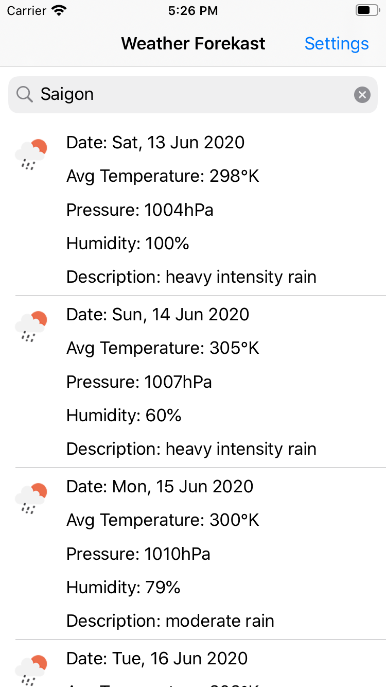
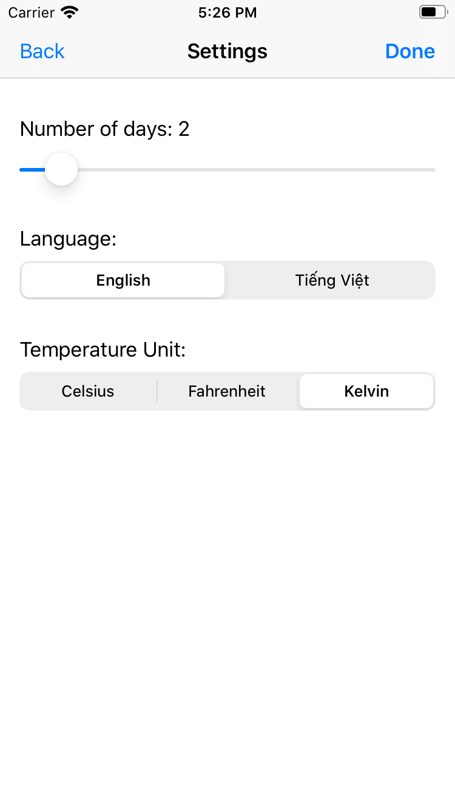
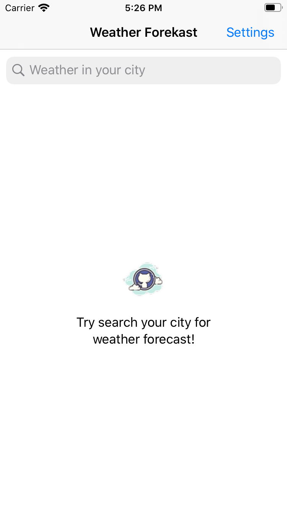

## Weather Forekast (Dự báo thời tuyết)
This application is sample app with MVVM structure and support from OpenWeatherMap API.

## Features
 - [x] Fetch weather forecast from OpenWeatherMap.
 - [x] Handle UI state (empty, loading, disconnected, error, not found).
 - [x] Paginate or batch requests for remote Github users in response to user interaction.
 - [x] Maintain a smooth experience (defined as approximately 60 fps).
 - [x] Respect the iOS Dynamic Type settings of the user.
 - [x] Support change configuration `number of days, language & temperature unit`.
 - [x] Localization with English and Vietnamese.
 - [x] Unit test with code coverage: `68.5%`

## Screenshots

## License
Weather Forekast is available under the MIT license.